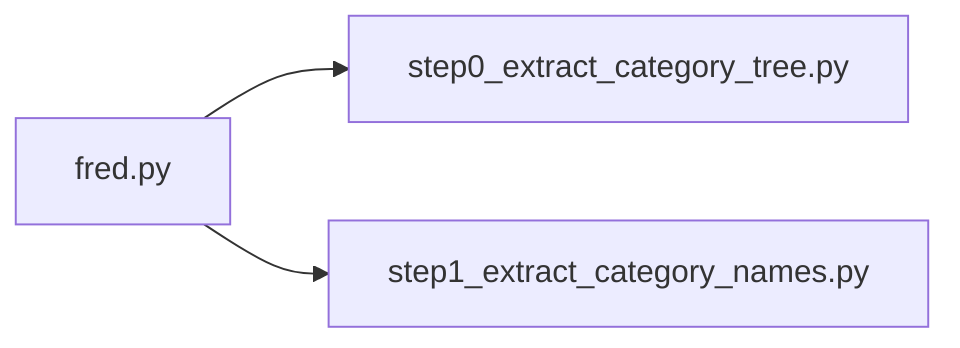

# fred-basics
Review of FRED (Federal Reserve Economic Data) API

**fred.py**
+ contains FredAPI class with multiple methods to query the
FRED API

**step0_extract_category_tree.py**
+ select a root node (for the overall tree this node is 0); other
roots could be selected to extract a subtree
+ returns a dict where the key is a parent node and the value
is a list of children nodes
+ there are ~5k categories and a limit to request that can be made
per second - traversal algorithm includes a call to time.sleep to slow
down requests (i.e., this takes time to run for the entire tree)
+ see ./json/fred_category_extract_test_2023_08_02.json for subtree
+ see ./json/frec_category_extract_2023_08_02.json for full tree

**step1_extract_category_names.py**
+ using category tree details (category_ids) from step0 query
against FRED to get category names
+ review category names to determine parent ids that are not
of interest (regional data, international data, academic data)